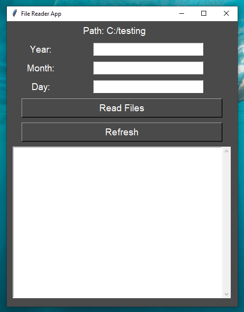
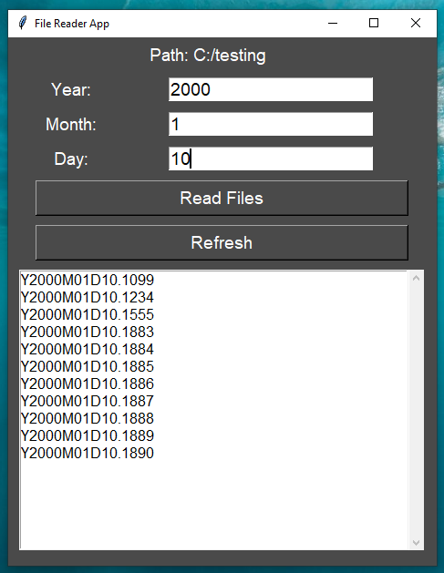

# Date-Stamped File Reader

A simple file name reader built with `tkinter`. It allows you to search for files adhering to a specific format, e.g. `Y2000M01D01.1234`. `Y` represents the year, `M` the month and `D` the day. It then displays the matching files in a list.
It is designed to work with a custom, date-stamped file naming convention.

Below is the application's GUI:

## How it Works

* __Directory Selection:__ The application first prompts you to select a directory. If you cancel or exit the dialog, it will ask if you wish to continue or terminate. Selecting '__Yes__' reopens the directory window and selecting '__No__' terminates the programme.
* __Input:__ Once the directory is selected, the main application window appears, allowing you to enter the __Year__, __Month__, and __Day__.
* __Search and Filter:__ Clicking '__Read Files__' (or pressing `Enter`) scans the directory. Files are filtered using a two-step process: a file check and a regular expression to ensure format validity. Matching files are then displayed in the listbox.
* __Refresh:__ To re-scan the directory, click '__Refresh__' or use the shortcut `Control + R`.

Below is an example of the application after use:

## Features

* __Persistent Directory Choice:__ If directory selection is cancelled, a `while` loop ensures the user explicitly chooses to continue the selection process or exit the programme.
* __Directory Display:__ Displays your selected directory at the top of the page.
* __Efficient Scanning:__ Uses `os.scandir` instead of `os.listdir` for improved performance. This optimisation allows the program to scan directories with ~10,000 files in just a few seconds. 
* __Input Validation:__ Displays a message box if non-numeric values or empty fields are entered, prompting the user to check their inputs.
* __Keyboard Shortcuts:__ Includes bindings for faster interaction: `Enter` to read files and `Control + R` to refresh.
* __Scrollable Output:__ The listbox includes a scrollbar for easily navigating large result sets.

## Modules

This program uses only standard libraries:

* os
* re
* sys
* tkinter
